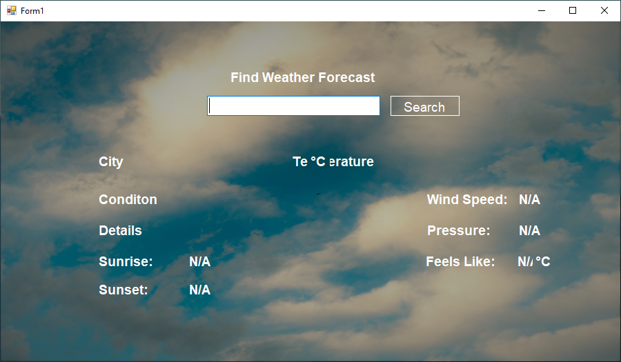
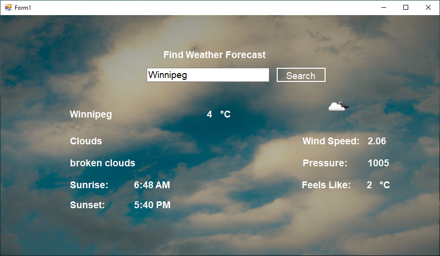

# WindowsWeatherApp
This is a Windows Weather App made using C# and REST Api.

When the project runs you are greated with a interface asking to enter a city name you want the wether information about: 

Once you enter the name of the city you want, details are given about the weather information about the place. 

For exaple we look at the weather information in winnipeg.

You can continue to run the application for different cities for eample Calgary. 

## Requirements: 

- Windows operating system. 
- Visual studio downloaded. 

## Steps

1. Clone the repo into a folder. 
2. Then open Visual studio from your Windows system. 
3. Select open project from file and open the Weather Application.sin using visual studio. 
4. Then run the program to get the ouput. 
